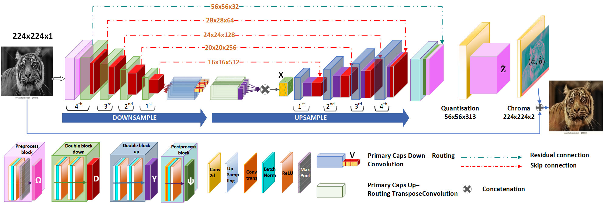
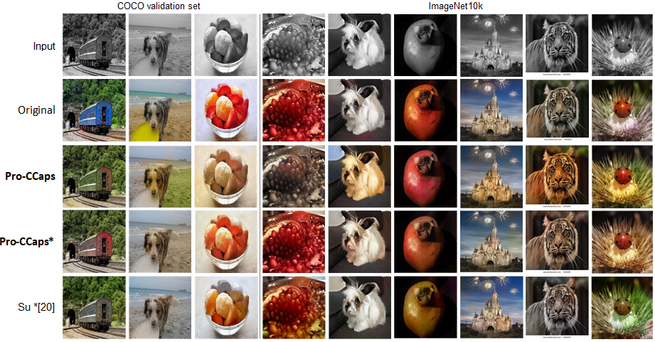

# Pro_CCaps
Automatic image colourisation studies how to colourisegreyscale  images.    Existing  approaches  exploit  convolu-tional layers that extract image-level features learning thecolourisation  on  the  entire  image,  but  miss  entities-levelones due to pooling strategies.  We believe that entity-levelfeatures are of paramount importance to deal with the in-trinsic multimodality of the problem (i.e., the same objectcan have different colours, and the same colour can havedifferent properties).  Models based on capsule layers aimto identify entity-level features in the image from differentpoints of view, but they do not keep track of global features.Our network architecture integrates entity-level featuresinto  the  image-level  features  to  generate  a  plausible  im-age colourisation.  We observed that results obtained withdirect  integration  of  such  two  representations  are  largelydominated  by  the  image-level  features,  thus  resulting  inunsaturated  colours  for  the  entities.   To  limit  such  an  is-sue,  we  propose  a  gradual  growth  of  the  reconstructionphase  of  the  model  while  training.By  advantaging  ofprior knowledge from each growing step, we obtain a sta-ble collaboration between image-level and entity-level fea-tures that ultimately generates stable and vibrant colouri-sations. Experimental results on three benchmark datasets,and a user study, demonstrate that our approach has com-petitive performance with respect to the state-of-the-art andprovides  more  consistent  colourisation.

## Architecture

The training procedure update the weigths of the reconstruction phase following a progressive learning procedure. 

## Results


## Usage

TODO: upload the trained model online

```python
# train the model
python main.py

# reproduce published results
python Generate_Validation_Results.py
```
## Paper published at WACV2021
https://openaccess.thecvf.com/content/WACV2022/html/Pucci_Pro-CCaps_Progressively_Teaching_Colourisation_to_Capsules_WACV_2022_paper.html

Please if you use this repository for you research, consider the possibility citing me:\
@inproceedings{pucci2022pro,
  title={Pro-CCaps: Progressively Teaching Colourisation to Capsules},
  author={Pucci, Rita and Micheloni, Christian and Foresti, Gian Luca and Martinel, Niki},
  booktitle={Proceedings of the IEEE/CVF Winter Conference on Applications of Computer Vision},
  pages={2271--2279},
  year={2022}
}
